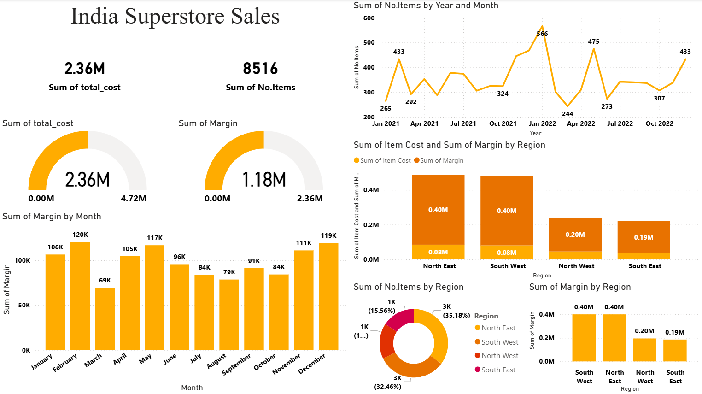
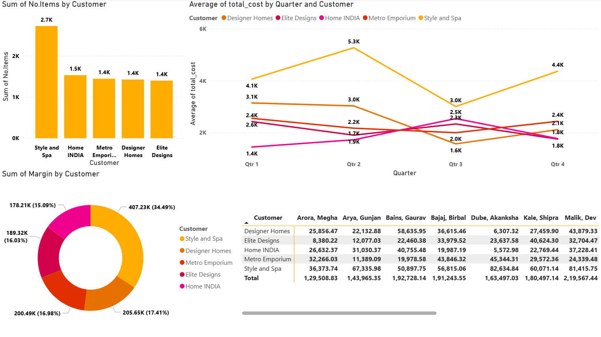
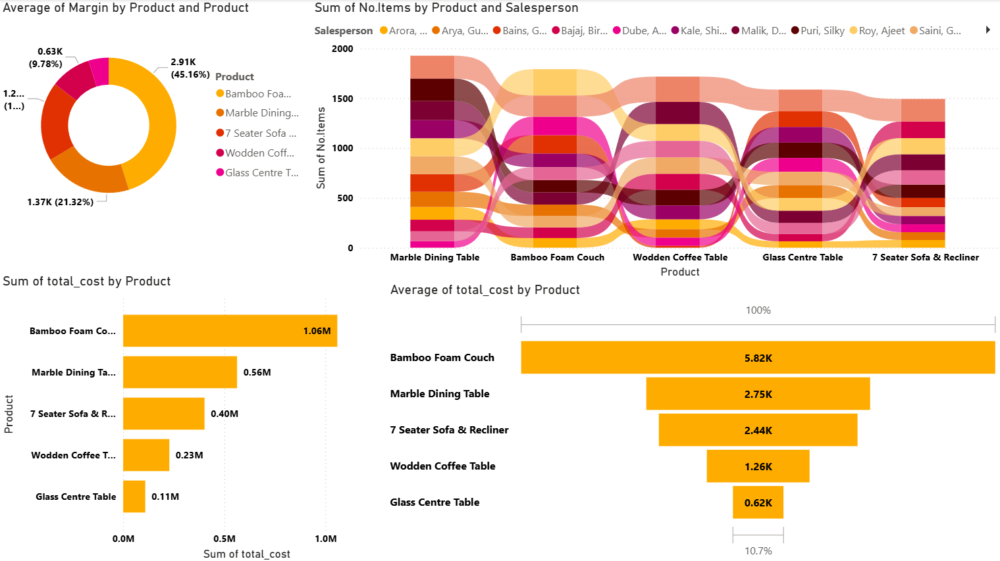

# 🛒 India Superstore Sales Dashboard (Power BI)

## 📌 Overview
This project presents a comprehensive **Power BI dashboard** analyzing India Superstore sales data.  
It provides insights into sales, profit, customer behavior, and product performance.

---

## 📊 Dashboard Preview

### 🔹 Page 1 – Sales Overview

### 🔹 Page 2 – Customer Analysis

### 🔹 Page 3 – Product Analysis

---

## 🔍 Key Insights
- Total Sales: **2.36M+**
- Profit Analysis across regions and products
- Monthly sales & margin trends
- Customer-wise contribution analysis
- Product performance comparison

---

## 🛠 Tools & Technologies
- Power BI
- Data Cleaning
- Data Visualization
- Business Intelligence

---

## 🎯 Features
- Interactive filters & slicers
- KPI Cards (Sales, Items, Margin)
- Region-wise and Customer-wise insights
- Multi-page dashboard design

---

## 🚀 Future Improvements
- Add forecasting (time-series prediction)
- Integrate Python for advanced analytics
- Build web-based dashboard version
